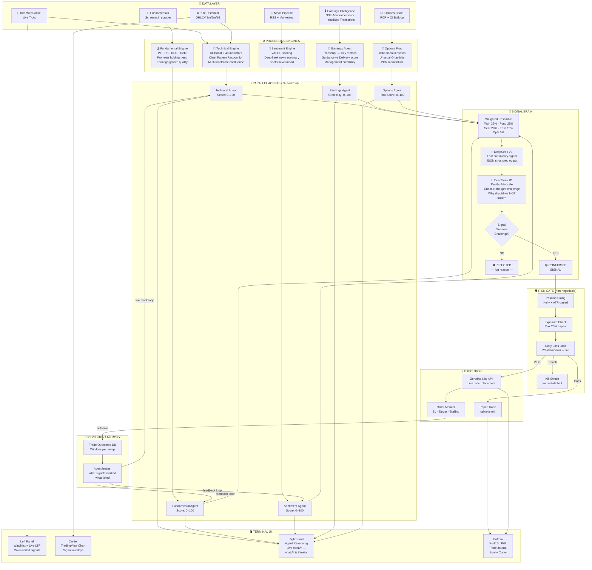

# My Trading Terminal Vision

## The Key Idea — Devil's Advocate

Sabse important cheez jo maine add ki:

**DeepSeek R1 ko deliberately ulti role diya.**

Pehle V3 bolega "BUY karo" — R1 ka kaam sirf yahi hai:
"10 reasons batao kyun ye trade FAIL ho sakta hai."

Agar R1 ke arguments weak hain → signal confirm.
Agar R1 strong counter hai → trade reject.

Ye ek extra filter hai jo overconfidence hatata hai.

## Management Credibility Score (Earnings Agent)

Har company ka ek score track karo:
- Q1 guidance diya tha 20% growth → actual kya aaya?
- Promoter holding badh rahi hai ya ghatt rahi?
- Concall mein positive words hain lekin numbers nahi?

Ye score fundamentals se zyada powerful hota hai.

## Options Flow (missing in current system)

PCR + Unusual OI = institutional bets dikh jaate hain.
Retail sab chart dekh raha, FII options mein khel raha hai.
