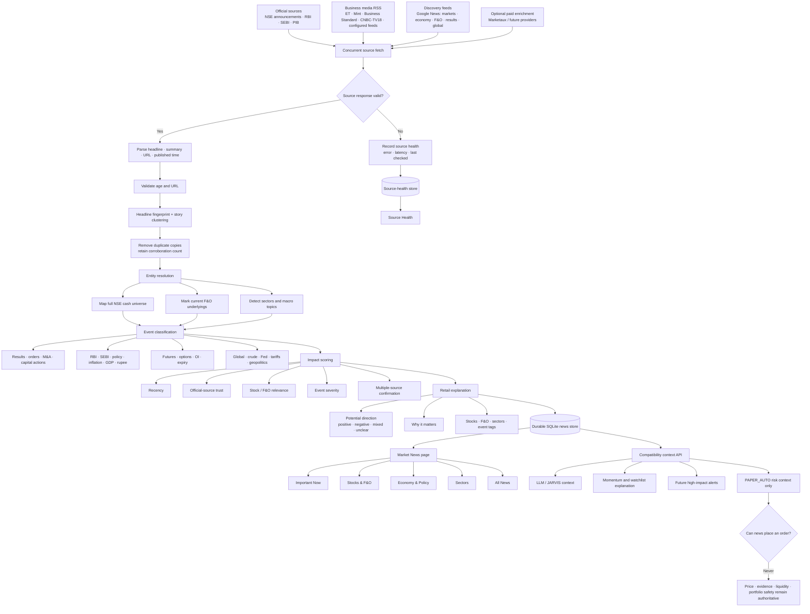
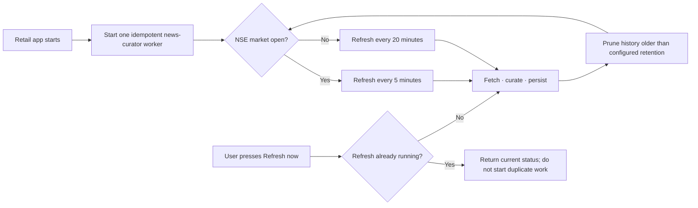

# QuantTerm News Curator — Automation Flow

## Product goal

Give a retail investor one high-coverage, continuously refreshed view of the news that can affect the Indian economy, cash equities, sectors, and current stock/index futures—without turning headlines into automatic trade instructions.

## End-to-end flow

## Automation schedule

## Trust hierarchy

1. **Tier 1 — official:** NSE corporate announcements, RBI, SEBI, PIB.
2. **Tier 2 — established business media:** existing configured RSS publishers.
3. **Tier 3 — discovery:** Google News searches used to increase coverage.

A Tier 3 headline cannot outrank a fresh Tier 1 filing merely because several websites repeated it.

## Retail doctrine

- Display a lot of news, but collapse repeated copies.
- Keep the original source link and publication time.
- Explain relevance in plain language.
- Show source outages rather than silently shrinking the feed.
- Treat direction as a text-derived cue, not a forecast.
- News may add context or block unsafe confidence; it may never bypass the existing evidence, price, liquidity, and risk gates.
